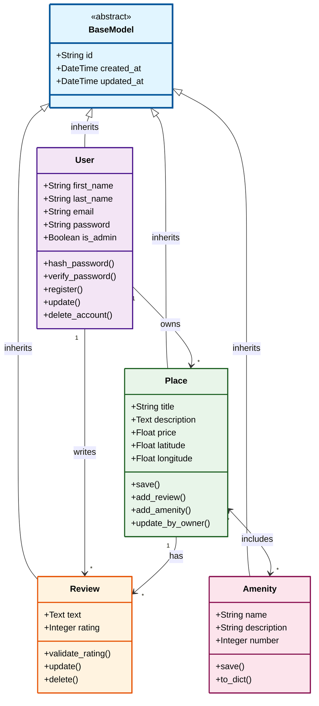

# Detailed Class Diagram for Business Logic Layer



---

## 📦 Entity Specifications

### 🏗️ BaseModel (Abstract)

**Purpose**: Foundation class for all entities

| Attribute | Type | Description |
|-----------|------|-------------|
| `id` | String (UUID) | Unique identifier |
| `created_at` | DateTime | Creation timestamp |
| `updated_at` | DateTime | Last modification timestamp |

All entities inherit these common attributes.

---

### 👤 User

**Purpose**: Authentication, authorization, and user management

#### Attributes

| Name | Type | Constraints |
|------|------|-------------|
| `first_name` | String(50) | Letters only, 1-50 chars |
| `last_name` | String(50) | Letters only, 1-50 chars |
| `email` | String(120) | **Unique**, valid format |
| `password` | String(128) | Bcrypt hashed |
| `is_admin` | Boolean | Default: False |

#### Methods

| Method | Description |
|--------|-------------|
| `hash_password()` | Encrypts password with bcrypt |
| `verify_password()` | Validates password during login |
| `register()` | Creates new user account |
| `update()` | Modifies user profile |
| `delete_account()` | Removes user from system |

#### Business Rules

```
✅ Email must be unique
✅ Password requirements:
   • Minimum 8 characters
   • At least 1 uppercase letter
   • At least 1 lowercase letter
   • At least 1 number
   • At least 1 special character
✅ Only admins can create places
❌ Admins cannot write reviews
```

---

### 🏠 Place

**Purpose**: Rental property listings with location data

#### Attributes

| Name | Type | Validation |
|------|------|------------|
| `title` | String(100) | 1-100 characters |
| `description` | Text | Non-empty string |
| `price` | Float | Must be > 0 |
| `latitude` | Float | -90 to 90 |
| `longitude` | Float | -180 to 180 |

#### Methods

| Method | Description |
|--------|-------------|
| `save()` | Updates timestamp and persists |
| `add_review()` | Associates review with place |
| `add_amenity()` | Links amenity to place |
| `update_by_owner()` | Modifies place (owner/admin only) |

#### Business Rules

```
✅ Must have valid owner (User)
✅ Only owner or admin can modify
✅ Price must be positive number
✅ Coordinates within valid ranges
✅ Can have multiple amenities (many-to-many)
✅ Can have multiple reviews (one-to-many)
```

---

### ⭐ Review

**Purpose**: User feedback and ratings for places

#### Attributes

| Name | Type | Validation |
|------|------|------------|
| `text` | Text | Non-empty string |
| `rating` | Integer | Must be 1-5 |

#### Methods

| Method | Description |
|--------|-------------|
| `validate_rating()` | Ensures rating is 1-5 |
| `update()` | Modifies review (author/admin only) |
| `delete()` | Removes review (author/admin only) |

#### Business Rules

```
❌ Users cannot review their own places
❌ Only ONE review per user per place
✅ Rating must be between 1-5 stars
✅ Only review author or admin can modify/delete
✅ Text cannot be empty
```

---

### ✨ Amenity

**Purpose**: Shared facilities and features across places

#### Attributes

| Name | Type | Description |
|------|------|-------------|
| `name` | String(50) | Amenity name (e.g., "WiFi") |
| `description` | String(100) | Details about amenity |
| `number` | Integer | Quantity available |

#### Methods

| Method | Description |
|--------|-------------|
| `save()` | Updates timestamp and persists |
| `to_dict()` | Serializes to dictionary |

#### Business Rules

```
✅ Can be shared across multiple places
✅ Many-to-many relationship with Place
✅ Name and description required
✅ Number field tracks quantity
```

---

## 🔗 Relationships

### Ownership & Authorship

```
User ──owns──▶ Place
     (1)      (0..*)

User ──writes──▶ Review
     (1)         (0..*)
```

### Place Associations

```
Place ──has──▶ Review
      (1)      (0..*)

Place ◀──includes──▶ Amenity
      (0..*)         (0..*)
```

---

## 🧬 Inheritance Hierarchy

```
BaseModel (Abstract)
    │
    ├── User
    │   └── Manages authentication
    │       └── Can own places
    │       └── Can write reviews
    │
    ├── Place
    │   └── Has location (lat/lng)
    │   └── Has price
    │   └── Links to amenities
    │
    ├── Review
    │   └── Belongs to user & place
    │   └── Has rating (1-5)
    │
    └── Amenity
        └── Shared feature
        └── Links to multiple places
```

---

## 📊 Cardinality Summary

| Relationship | Cardinality | Description |
|--------------|-------------|-------------|
| User → Place | 1:N | One user owns many places |
| User → Review | 1:N | One user writes many reviews |
| Place → Review | 1:N | One place has many reviews |
| Place ↔ Amenity | M:N | Many places share many amenities |

---

## 🎯 Key Design Decisions

✅ **Single Inheritance** - All entities extend BaseModel
✅ **Automatic Timestamps** - created_at/updated_at managed by BaseModel
✅ **UUID Primary Keys** - Globally unique identifiers
✅ **Bcrypt Hashing** - Secure password storage
✅ **Many-to-Many** - Place-Amenity relationship via association table
