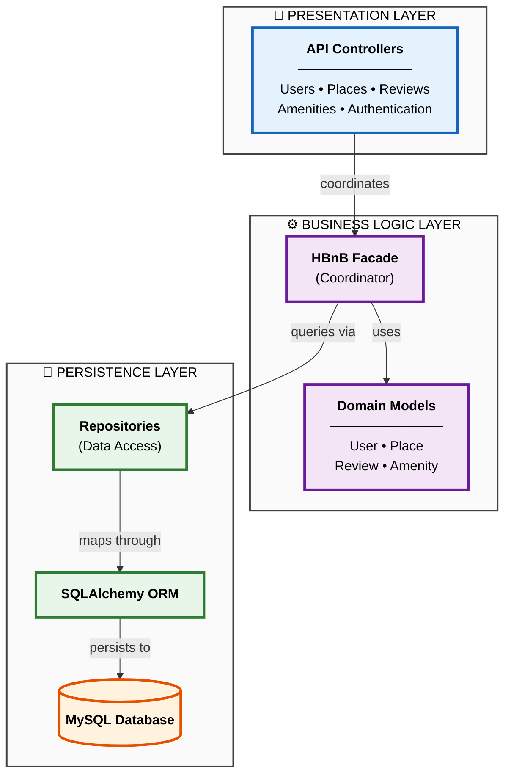

# High-Level Package Diagram



---

## 📋 Layer Responsibilities

### 🎯 Presentation Layer
**Handles all HTTP requests and responses**

```
┌─────────────────────────────────────────┐
│  API Controllers (Flask-RESTX)          │
├─────────────────────────────────────────┤
│  • Users API     → Registration, Login  │
│  • Places API    → CRUD Operations      │
│  • Reviews API   → Feedback System      │
│  • Amenities API → Facility Management  │
│  • Auth API      → JWT Authentication   │
└─────────────────────────────────────────┘
```

**Key Functions:**
- Request validation
- Authentication (JWT)
- Response serialization
- Error handling

---

### ⚙️ Business Logic Layer
**Enforces business rules and domain logic**

```
┌─────────────────────────────────────────┐
│  HBnB Facade (Facade Pattern)           │
├─────────────────────────────────────────┤
│  Single entry point for all operations  │
│  • Coordinates models & repositories    │
│  • Enforces business rules              │
│  • Manages transactions                 │
└─────────────────────────────────────────┘

┌─────────────────────────────────────────┐
│  Domain Models                          │
├─────────────────────────────────────────┤
│  • User     → Auth & Roles              │
│  • Place    → Properties & Location     │
│  • Review   → Ratings & Feedback        │
│  • Amenity  → Features & Facilities     │
│  • BaseModel → Shared Attributes        │
└─────────────────────────────────────────┘
```

**Key Functions:**
- Business rule validation
- Domain logic execution
- Entity relationships
- State management

---

### 💾 Persistence Layer
**Manages all data storage and retrieval**

```
┌─────────────────────────────────────────┐
│  Repositories (Repository Pattern)      │
├─────────────────────────────────────────┤
│  • UserRepository     → User queries    │
│  • PlaceRepository    → Place queries   │
│  • ReviewRepository   → Review queries  │
│  • SQLAlchemyRepo     → Generic CRUD    │
└─────────────────────────────────────────┘

┌─────────────────────────────────────────┐
│  SQLAlchemy ORM                         │
├─────────────────────────────────────────┤
│  Object ←→ Relational mapping           │
└─────────────────────────────────────────┘

┌─────────────────────────────────────────┐
│  MySQL Database                         │
├─────────────────────────────────────────┤
│  Persistent data storage                │
└─────────────────────────────────────────┘
```

**Key Functions:**
- Data access abstraction
- Query optimization
- Transaction management
- Database connection pooling

---

## 🔄 Request Flow

```
┌──────────┐    ┌──────────┐    ┌──────────┐    ┌──────────┐    ┌──────────┐
│          │    │          │    │          │    │          │    │          │
│  Client  │───▶│   API    │───▶│  Facade  │───▶│   Repo   │───▶│ Database │
│          │    │          │    │          │    │          │    │          │
└──────────┘    └──────────┘    └──────────┘    └──────────┘    └──────────┘
                      │              │
                      ▼              ▼
                 Validation    Business Rules
```

---

## 🎨 Design Patterns

| Pattern | Layer | Purpose |
|---------|-------|---------|
| **Facade** | Business Logic | Simplifies complex subsystem interactions |
| **Repository** | Persistence | Abstracts data access logic |
| **MVC** | All Layers | Separates concerns (Model-View-Controller) |

---

## ✨ Key Benefits

✅ **Separation of Concerns** - Each layer has clear responsibilities
✅ **Testability** - Layers can be tested independently
✅ **Maintainability** - Changes isolated to specific layers
✅ **Scalability** - Easy to add new features or modify existing ones
✅ **Reusability** - Components can be reused across the application
