# Sequence Diagrams for API Calls

## 1. User Registration

```mermaid
sequenceDiagram
    actor Client
    participant API as 🎯 API Layer
    participant Facade as ⚙️ Facade
    participant Repository as 💾 Repository
    participant Database as 🗄️ Database

    Client->>+API: POST /api/v1/users
    Note over API: Validate input format
    API->>+Facade: create_user(data)
    Facade->>+Repository: get_user_by_email(email)
    Repository->>+Database: SELECT WHERE email=?
    Database-->>-Repository: null (email available)
    Repository-->>-Facade: null
    Note over Facade: Hash password with bcrypt
    Facade->>+Repository: add(user)
    Repository->>+Database: INSERT INTO users
    Database-->>-Repository: Success
    Repository-->>-Facade: User created
    Facade-->>-API: User object
    API-->>-Client: 201 Created + user_id
```



**Success**: User account created with hashed password
**Failure**: 400 if email exists or invalid data

---

## 2. User Login


**Success**: JWT token issued (24h expiration)
**Failure**: 401 if invalid credentials

---

## 3. Place Creation

```mermaid
sequenceDiagram
    actor Client
    participant API as 🎯 API Layer
    participant Facade as ⚙️ Facade
    participant Repository as 💾 Repository
    participant Database as 🗄️ Database

    Client->>+API: POST /api/v1/places + JWT
    Note over API: Verify JWT token
    API->>+Facade: create_place(data, user_id)
    Note over Facade: Validate price > 0<br/>Validate coordinates
    Facade->>+Repository: add(place)
    Repository->>+Database: INSERT INTO places
    Database-->>-Repository: Success
    Repository-->>-Facade: Place created
    Facade-->>-API: Place object
    API-->>-Client: 201 Created + place_id
```



**Success**: Place created and linked to owner
**Failure**: 400 if validation fails, 401 if unauthorized

---

## 4. Review Submission

```mermaid
sequenceDiagram
    actor Client
    participant API as 🎯 API Layer
    participant Facade as ⚙️ Facade
    participant Repository as 💾 Repository
    participant Database as 🗄️ Database

    Client->>+API: POST /api/v1/reviews + JWT
    API->>+Facade: create_review(data, user_id)

    Note over Facade: Business Rule Check #1:<br/>User cannot review own place
    Facade->>+Repository: get_place_owner(place_id)
    Repository->>+Database: SELECT owner_id
    Database-->>-Repository: owner_id
    Repository-->>-Facade: owner_id

    Note over Facade: Business Rule Check #2:<br/>No duplicate reviews
    Facade->>+Repository: get_review(place_id, user_id)
    Repository->>+Database: SELECT WHERE place_id AND user_id
    Database-->>-Repository: null (no duplicate)
    Repository-->>-Facade: null

    Facade->>+Repository: add(review)
    Repository->>+Database: INSERT INTO reviews
    Database-->>-Repository: Success
    Repository-->>-Facade: Review created
    Facade-->>-API: Review object
    API-->>-Client: 201 Created + review_id
```



**Success**: Review posted with rating
**Failure**: 400 if self-review or duplicate

---

## 5. Fetch Places

```mermaid
sequenceDiagram
    actor Client
    participant API as 🎯 API Layer
    participant Facade as ⚙️ Facade
    participant Repository as 💾 Repository
    participant Database as 🗄️ Database

    Client->>+API: GET /api/v1/places
    API->>+Facade: get_all_places()
    Facade->>+Repository: get_all()
    Note over Repository: Eager loading with JOINs:<br/>places + amenities + reviews
    Repository->>+Database: SELECT * FROM places<br/>LEFT JOIN place_amenity<br/>LEFT JOIN amenities
    Database-->>-Repository: Places with related data
    Repository-->>-Facade: Place objects (list)
    Facade-->>-API: Place objects
    Note over API: Serialize to JSON<br/>(exclude sensitive fields)
    API-->>-Client: 200 OK + [places]
```



**Success**: Returns all places with amenities and reviews
**Performance**: Single query with eager loading

---

## Architecture Flow

```
Client → API → Facade → Repository → Database
         ↓       ↓
    Validation  Business Rules
```

### Key Features

| Layer | Responsibility |
|-------|---------------|
| **API** | Authentication, input validation, serialization |
| **Facade** | Business rules, authorization checks |
| **Repository** | Database operations, query optimization |
| **Database** | Data persistence (MySQL) |

### Security

- **Authentication**: JWT tokens (24h expiration)
- **Password**: Bcrypt hashing
- **Authorization**: Owner/admin checks in Facade layer

### Business Rules

- ✅ Unique email per user
- ✅ Password strength requirements
- ✅ No self-reviews
- ✅ One review per user per place
- ✅ Rating must be 1-5
- ✅ Only owner/admin can modify places
